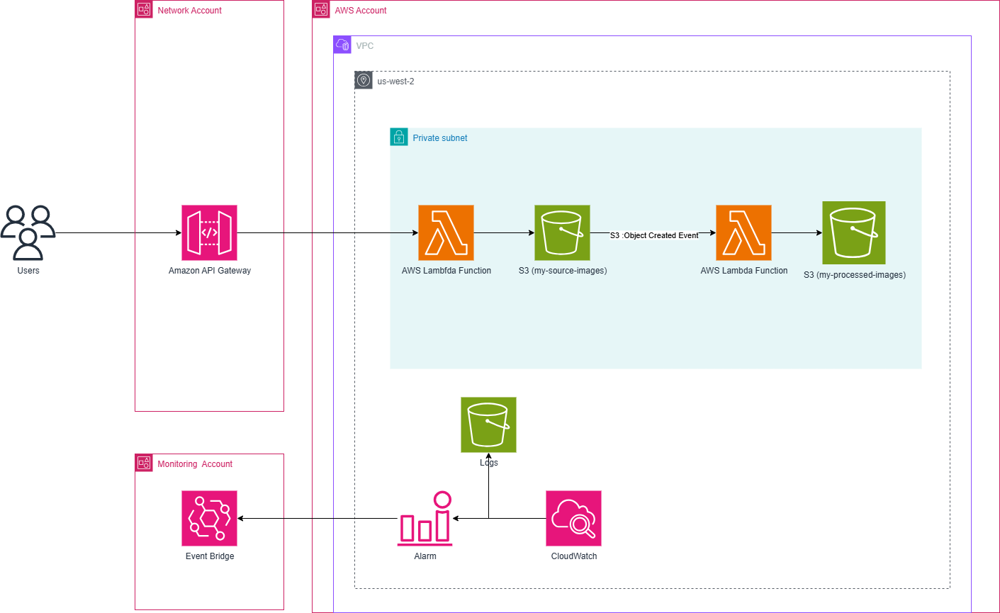

# 📊 Project-Diagrams

This repository showcases architecture diagrams and solution overviews for three AWS-based projects, demonstrating scalable, serverless, and event-driven application design patterns.

---

## 🚀 Project 1: Scalable Web Application with ALB and Auto Scaling

This project demonstrates how to deploy a scalable and highly available web application on Amazon Web Services (AWS) using Amazon EC2, Application Load Balancer (ALB), and Auto Scaling Groups (ASG). The architecture is designed to handle varying loads efficiently while maintaining high performance and cost-effectiveness.

### 📝 Solution Architecture Diagram

- The diagram illustrates the flow of a user request to the **Application Load Balancer (ALB)**, which acts as a single point of contact.
- The **ALB** distributes traffic to a group of **EC2 instances** managed by an **Auto Scaling Group (ASG)**.
- These instances are located in a **private subnet**, ensuring they are not directly accessible from the public internet.
- The **ASG** automatically adds or removes EC2 instances based on demand.
- For data persistence, a **Multi-AZ Amazon RDS** instance is used, providing high availability for the backend database.
- CloudWatch monitors the system, and if a metric threshold is breached (e.g., high CPU utilization), it can trigger an SNS alert to notify administrators.

---

## 🖼️ Project 2: Serverless Image Processing with S3 and Lambda

This project demonstrates a fully serverless, event-driven architecture for image processing on AWS. The solution automatically resizes images uploaded by a user through an API Gateway, showcasing the power of Amazon API Gateway, AWS Lambda, and Amazon S3. This approach is highly cost-effective and scales automatically to meet demand.

### 📝 Solution Architecture Diagram

The diagram below illustrates the event-driven workflow.
- A user uploads an image via an **API Gateway** endpoint.
- This action triggers an **AWS Lambda** function that handles the image upload and stores it in the **Source S3 Bucket**.
- The **S3 upload event** then triggers a second **Lambda** function.
- This second function contains the **image processing logic** (e.g., resizing, watermarking).
- It retrieves the image from the **source bucket**, processes it, and saves the new, processed image to the **Destination S3 Bucket**.
- In a separate **monitoring account**, **Amazon CloudWatch Alarms** are configured to monitor the Lambda function's performance. These alarms trigger **Amazon EventBridge rules**, which can send notifications or perform automated actions based on the metrics.
- All service interactions are **secured and managed using AWS IAM roles**.

---

## 🌐 Project 3: Serverless REST API with DynamoDB and API Gateway

This project demonstrates the creation of a serverless REST API for performing CRUD (Create, Read, Update, Delete) operations on data stored in Amazon DynamoDB. The solution uses Amazon API Gateway as the API endpoint and AWS Lambda to handle all business logic, eliminating the need for any server management.

### 📝 Solution Architecture Diagram

The diagram illustrates the user's request flow. 
- A user interacts with the **REST API** exposed by **Amazon API Gateway**.
- Each API endpoint (e.g., `/items`) and HTTP method (e.g., `GET`, `POST`) is linked to a specific **AWS Lambda** function.
- These Lambda functions execute the **business logic** for the CRUD operations.
- The functions interact with an **Amazon DynamoDB** table, which acts as the **backend NoSQL database**.
- **IAM roles** are used to grant the Lambda functions the necessary permissions to **read from** and **write to** the DynamoDB table.
  

## 📚 Summary

These projects demonstrate how to:

- Build **scalable**, **highly available**, and **serverless** architectures on AWS  
- Leverage key AWS services for different use cases  
- Apply best practices for security, monitoring, and automation

